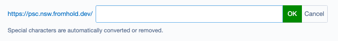
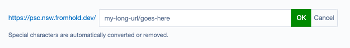
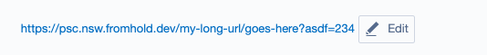

# silverstripe-relativeurlfield

Similar to SiteTreeURLSegmentField except:
- No `SiteTree` dependency - use anywhere
- Set a `BaseURL` (or `Director::absoluteBaseURL` as fallback)
- User can enter a URL slug - or a full URL path (toggled via field setting)
- User can include query string or not (toggled via field setting)
- Based on URL slug (or full path), collision checks are performed, and `-n` counter added to value
- By default, using BaseURL and supplied URL slug/path, collision with pages in site tree is checked
- Base URL is always displayed to user, including when entering relative url path, so that the user sees the context and understands which part of the url they should be entering

Only tested in SS5 but should work in SS4 too.

### Straight-forward to use:

```php

$field = RelativeURLField::create('FieldName', 'Field Title');

// available toggles/settings
$field->setBaseURL();                           // The base URL that the user-entered value is relative to. Defaults to Director::absoluteBaseURL().
$field->setBaseURLBySiteTree();                 // Pass a SiteTree object here, to use it's AbsoluteLink as the BaseURL (useful for Multisites for example, pass the Site object).
$field->setIsQueryStringAllowed();              // Can user include a query string? (will be stripped if not)
$field->setisFullPathAllowed();                 // Can user enter a path with multiple slugs? (else their value will have '/'s removed)
$field->setHelpText();                          // Special chars text

// manage collision checks
$field->addCollisionCheck($key, ?$callable);   // pass a string Key and either implement check via $callable, or use Key via extension hook
$field->removeCollisionCheck($key);            // remove by Key. 'sitetree' is enabled by default.
```


### Couple of screenshots to give the gist







